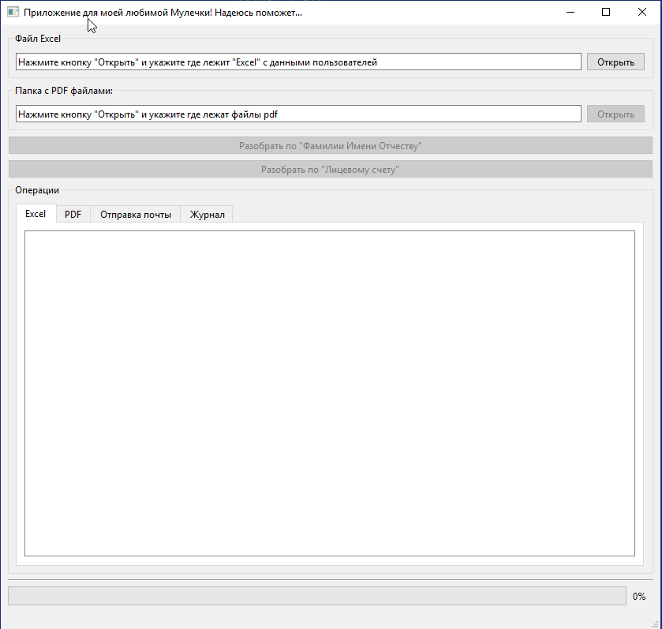

# Kvartplata24mail
Программа для рассылки созданных в КВАРТПЛАТА24 расчеток по почтовым ящикам жильцов.

Программа сделана, чтобы помочь своей жене. Она очень много времени тратила на сортировку pdf документов и рассылку их по электронной почте.
Дання программа состоит из 2-х блоков. 
1. Блок сортирует pdf файлы по адресам или ФИО (созадет папку и кладет туда нужные документы)
2. Отправляет на ящик электронной почты письмо со вложениями (отсортированными pdf)

До разработки данной программы она тратила на данную работу 3 дня
После использования тратится примерно 30 минут. 

Моя жена довольна - это шлавное.

